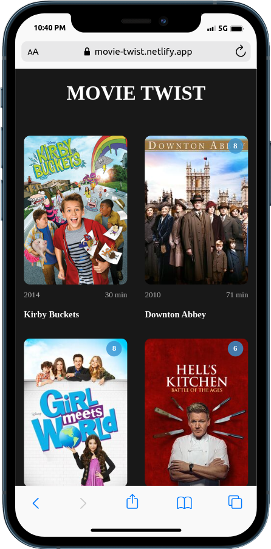
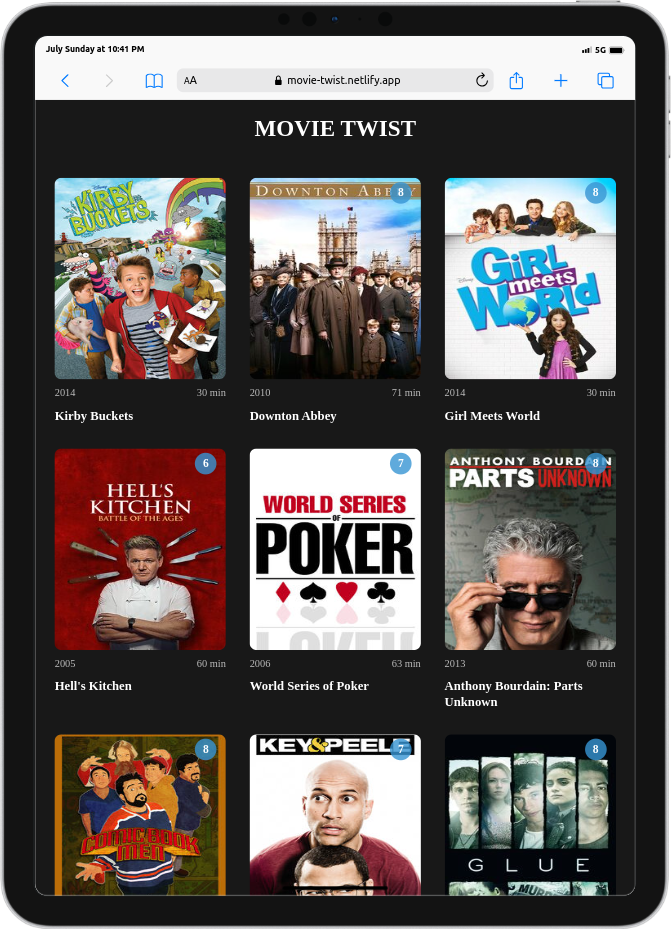
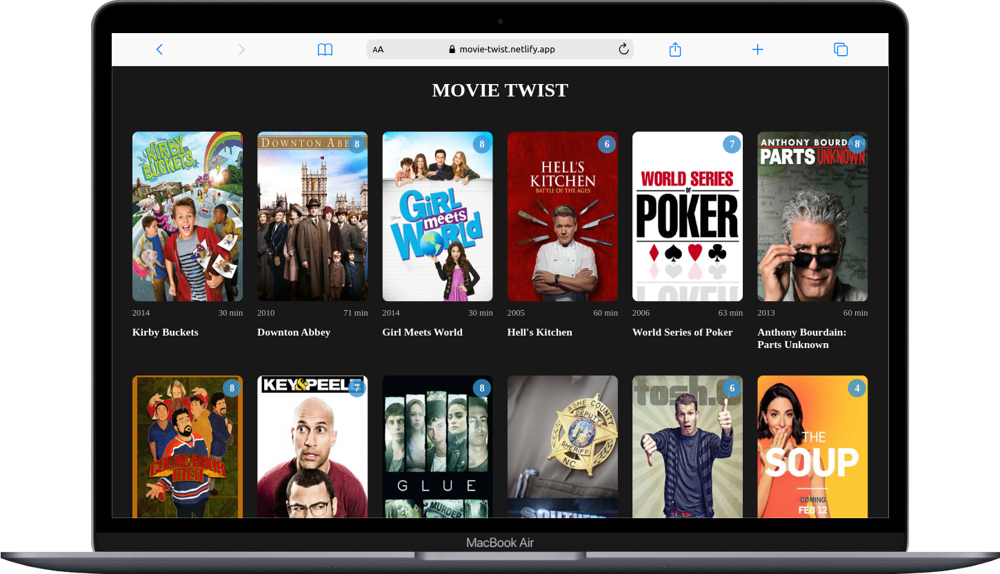

<div align="center">

  <h2>MOVIE TWIST FRONTEND</h2>

</div>

<!-- TABLE OF CONTENTS -->

# 📗 Table of Contents

- [📖 About the Project](#about-project)
  - [🛠 Built With](#built-with)
    - [Tech Stack](#tech-stack)
    - [Key Features](#key-features)
  - [🚀 Project Intro Video](#project-intro-video)  
  - [🚀 Live Demo](#live-demo)
- [💻 Getting Started](#getting-started)
  - [Prerequisites](#prerequisites)
  - [Setup](#setup)
  - [Install](#install)
  - [Usage](#usage)
- [👥 Authors](#authors)
- [🤝 Contributing](#contributing)
- [⭐️ Show your support](#support)
- [🙏 Acknowledgements](#acknowledgements)
- [📝 License](#license)

<!-- PROJECT DESCRIPTION -->

# 📖 MOVIE TWIST FRONT END <a name="about-project"></a>

This React app is a user-friendly and efficient solution for retrieving and displaying movie information. The app seamlessly integrates with external APIs to fetch the latest and most accurate data, ensuring users have access to up-to-date movie details.

## APP SCREENSHOTS

<div>
  
  
  
<div/>

## 🛠 Built With <a name="built-with"></a>

### Tech Stack <a name="tech-stack"></a>

  <ul>
    <li><a href="https://reactjs.org/">React.js</a></li>
      <li><a href="https://www.styled-components.com/">Styled-Components</a></li>
  </ul>

<!-- Features -->

### Key Features <a name="key-features"></a>

- **Display all data list**
- **Pagination**

<!-- INTODUCTION VIDEO -->

## 🚀 Project Intro Video <a name="project-intro-video"></a>

- [Project Intro Video]()

<!-- LIVE DEMO -->

## 🚀 Live Demo <a name="live-demo"></a>

- [Live Demo Link]()

<!-- GETTING STARTED -->

## 💻 Getting Started <a name="getting-started"></a>

To get a local copy up and running, follow these steps.

### Prerequisites

In order to run this project you need:
 
 - Code editor
 - Browser

### Setup

Clone this repository to your desired folder:

```sh
  git git@github.com:levy002/movie_twist_frontend.git
```

### Install

Install this project with:

```sh
  cd <directory>
  npm install
```

### Usage

To run the project, execute the following command:


```sh
  npm start
```

<!-- AUTHORS -->

## 👥 Authors <a name="authors"></a>

👤 **LEVY UKWISHAKA**

- GitHub: [@levy002](https://github.com/levy002)
- Twitter: [@levy_ukwishaka](https://twitter.com/levy_ukwishaka)
- LinkedIn: [@levy-ukwishaka](https://www.linkedin.com/in/levy-ukwishaka/)

<!-- CONTRIBUTING -->

## 🤝 Contributing <a name="contributing"></a>

Contributions, issues, and feature requests are welcome!

Feel free to check the [issues page](../../issues/).

<!-- SUPPORT -->

## ⭐️ Show your support <a name="support"></a>

If you like this project please leave ⭐️ 

<!-- ACKNOWLEDGEMENTS -->

## 🙏 Acknowledgments <a name="acknowledgements"></a>

I would like to thank Lorenzo for effering me the guidance.

<!-- LICENSE -->

## 📝 License <a name="license"></a>

This project is [MIT](./LICENSE) licensed.

